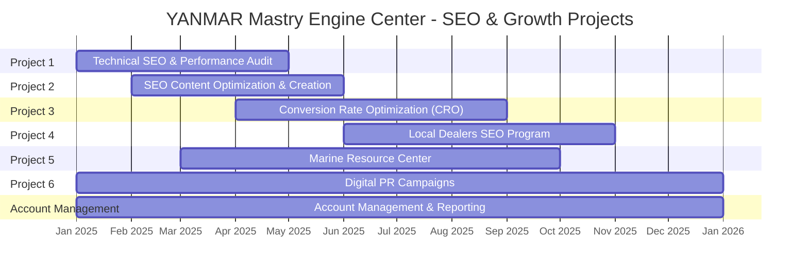

# SEO & Growth Consulting Proposal for YANMAR Mastry Engine Center

Prepared by Dan Kuthy, CEO
Prepared for Kevin Carlan, President
Date: November 15, 2024

## Scope of Work

| Project # | Project Name | Est. Completion Date | Complete When | Cost |
|-----------|--------------|---------------------|---------------|------|
| 1 | Website Technical SEO & Performance Audit | May 1, 2025 | Medium-level technical audit delivered and implemented | $24,440 |
| 2 | SEO Content Optimization & Creation | June 1, 2025 | Content optimized and implemented | $38,000 |
| 3 | Conversion Rate Optimization (CRO) | September 1, 2025 | CRO recommendations implemented | $19,200 |
| 4 | Local Dealers SEO Program | November 1, 2025 | Dealer pages and recommendations delivered | $79,200 |
| 5 | Create The Marine Resource Center | October 1, 2025 | 500 articles published | $35,300 |
| 6 | Digital PR Campaigns | January 1, 2026 | Links acquired, reports promoted | $48,400 |
| - | Account Management & Reporting | January 1, 2026 | Ongoing throughout program | Included |
|   | **Total Investment** |  |  | **$244,540** |

### Project 1: Website Technical SEO & Performance Audit

**Problem:**
YANMAR Mastry Engine Center's digital success depends on establishing a robust technical foundation for its online presence. Currently, the website requires a comprehensive evaluation to ensure optimal visibility and performance in search engines. Without this foundation, even the most sophisticated SEO strategies may fall short of their potential. A thorough technical audit is essential to identify and address any barriers preventing Google from effectively discovering, crawling, and indexing the site's valuable content. Additionally, in today's mobile-first environment, page load performance directly impacts both search rankings and user engagement, making technical optimization crucial for competitive advantage.

**Solution:**
After analyzing the YANMAR Mastry Engine Center domain, Trend Growth Partners will conduct our Medium-level Technical SEO and Performance Audit, which examines 55+ of the most important technical and performance factors that impact search visibility and user experience. This carefully scoped audit includes:

- Deep analysis of crawling and indexation patterns using Google Search Console data
- Systematic site-wide crawls to identify technical optimization opportunities
- Implementation of Google's Core Web Vitals framework to assess and improve performance
- Detailed Lighthouse analysis for performance, accessibility, and best practices
- Strategic recommendations for improved content structure and technical SEO elements

This medium-complexity audit is specifically designed to address the most impactful technical factors while maintaining cost-effectiveness. Our methodology ensures thorough examination of all crucial technical aspects affecting search performance and user experience.

**Keys to Success:**
- Execute a meticulous and comprehensive audit process, leaving no stone unturned
- Implement strategic prioritization of fixes to maximize the impact of our implementation budget
- Establish clear validation protocols to ensure all technical barriers are removed before advancing broader SEO initiatives
- Maintain continuous communication with the client team throughout the audit and implementation process

**Implementation Time:**
We have budgeted 40 hours for the implementation of technical SEO and performance optimization recommendations on the website.

**Cost & Timeline:**
The cost of Project 1 is $24,440 and is expected to take approximately 4 months to complete.

**Expected Completion Date:**
This project is expected to be completed by May 1, 2025.

**Project Complete When:**
1. Comprehensive technical audit findings and recommendations have been delivered to YANMAR Mastry Engine Center
2. Priority technical fixes have been implemented within the allocated 40 implementation hours
3. All critical technical impediments to SEO success have been identified and addressed
4. Implementation effectiveness has been validated through follow-up testing and analysis

**Why Make This Investment?:**
- Enhance user experience through improved page load times and smoother site performance
- Strengthen search visibility by ensuring Google can effectively understand and index your content
- Optimize the distribution of site authority through improved internal linking and technical structure
- Create a solid technical foundation for all future digital marketing initiatives
- Reduce bounce rates and improve conversion potential through better technical performance
- Benefit from a strategically scoped Medium-level audit that addresses the most critical technical factors while maintaining cost-effectiveness

**Resources Needed from Client:**
- Administrative access to the website content management system
- Access credentials for Google Search Console and Google Analytics
- Authorization to implement technical changes on the website
- Timely feedback and approvals for proposed technical modifications
- Access to development resources when needed for complex technical implementations

### Project 2: SEO Content Optimization & Creation

**Problem:**
YANMAR Mastry Engine Center's website content currently lacks strategic alignment with proven search demand in the marine engine market. While the existing content serves informational purposes, it has not been optimized to capture high-value organic search traffic. Our analysis indicates significant missed opportunities in search visibility, with competitors currently dominating search results for crucial industry terms and product-related queries. Without a data-driven keyword strategy and SEO-optimized content, YANMAR Mastry Engine Center is missing opportunities to connect with potential customers at critical stages of their purchase journey.

**Solution:**
Trend Growth Partners will implement a comprehensive content optimization strategy that includes:

- In-depth keyword research using Ahrefs' industry-leading database to identify high-value search opportunities
- Strategic keyword mapping and categorization based on user intent and topic relevance
- Identification and prioritization of top 20 high-impact content opportunities
- Development of detailed SEO content briefs for new and existing pages
- Professional content creation and optimization, with 100 implementation hours dedicated to content development
- Strategic alignment of content with user search intent and business objectives

This methodical approach ensures that every piece of content is purposefully designed to capture relevant search traffic while serving user needs effectively.

**Keys to Success:**
- Execute comprehensive keyword research that covers all relevant market segments and user intents
- Maintain unwavering focus on content quality and user experience while implementing SEO best practices
- Develop content that authentically represents YANMAR Mastry Engine Center's expertise and value proposition
- Ensure perfect alignment between search intent and content delivery
- Create scalable content templates and processes for future optimization

**Implementation Time:**
We have budgeted 100 hours for the creation and optimization of content across identified priority pages.

**Cost & Timeline:**
The cost of Project 2 is $38,000 and is expected to take approximately 4 months to complete.

**Expected Completion Date:**
This project is expected to be completed by June 1, 2025.

**Project Complete When:**
1. Comprehensive keyword research and strategy document has been delivered
2. Detailed SEO content briefs have been created for all priority pages
3. New and optimized content has been implemented across identified pages

**Why Make This Investment?:**
- Capture increased organic search traffic from high-intent, non-branded keywords
- Improve search engine rankings for business-critical terms and topics
- Enhance user experience through better-aligned, more comprehensive content
- Build authoritative topical relevance in key market segments
- Generate more qualified leads through improved content targeting
- Establish sustainable competitive advantage in organic search results
- Create scalable content optimization framework for future growth

**Resources Needed from Client:**
- Access to website content management system (CMS)
- Subject matter expert input for technical content validation
- Access to existing sales and marketing assets
- Strategic guidance on product and service prioritization
- Timely feedback and approval on content direction
- Industry expertise to ensure technical accuracy
