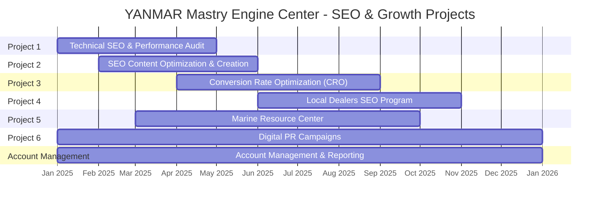

# SEO & Growth Consulting Proposal for YANMAR Mastry Engine Center

Prepared by Dan Kuthy, CEO
Prepared for Kevin Carlan, President
Date: November 15, 2024

## Scope of Work

| Project # | Project Name | Est. Completion Date | Complete When | Cost |
|-----------|--------------|---------------------|---------------|------|
| 1 | Website Technical SEO & Performance Audit | May 1, 2025 | Medium-level technical audit delivered and implemented | $24,440 |
| 2 | SEO Content Optimization & Creation | June 1, 2025 | Content optimized and implemented | $38,000 |
| 3 | Conversion Rate Optimization (CRO) | September 1, 2025 | CRO recommendations implemented | $19,200 |
| 4 | Local Dealers SEO Program | November 1, 2025 | Dealer pages and recommendations delivered | $79,200 |
| 5 | Create The Marine Resource Center | October 1, 2025 | 500 articles published | $35,300 |
| 6 | Digital PR Campaigns | January 1, 2026 | Links acquired, reports promoted | $48,400 |
| - | Account Management & Reporting | January 1, 2026 | Ongoing throughout program | Included |
|   | **Total Investment** |  |  | **$244,540** |

### Project 1: Website Technical SEO & Performance Audit

**Problem:**
YANMAR Mastry Engine Center's digital success depends on establishing a robust technical foundation for its online presence. Currently, the website requires a comprehensive evaluation to ensure optimal visibility and performance in search engines. Without this foundation, even the most sophisticated SEO strategies may fall short of their potential. A thorough technical audit is essential to identify and address any barriers preventing Google from effectively discovering, crawling, and indexing the site's valuable content. Additionally, in today's mobile-first environment, page load performance directly impacts both search rankings and user engagement, making technical optimization crucial for competitive advantage.

**Solution:**
After analyzing the YANMAR Mastry Engine Center domain, Trend Growth Partners will conduct our Medium-level Technical SEO and Performance Audit, which examines 55+ of the most important technical and performance factors that impact search visibility and user experience. This carefully scoped audit includes:

- Deep analysis of crawling and indexation patterns using Google Search Console data
- Systematic site-wide crawls to identify technical optimization opportunities
- Implementation of Google's Core Web Vitals framework to assess and improve performance
- Detailed Lighthouse analysis for performance, accessibility, and best practices
- Strategic recommendations for improved content structure and technical SEO elements

This medium-complexity audit is specifically designed to address the most impactful technical factors while maintaining cost-effectiveness. Our methodology ensures thorough examination of all crucial technical aspects affecting search performance and user experience.

**Keys to Success:**
- Execute a meticulous and comprehensive audit process, leaving no stone unturned
- Implement strategic prioritization of fixes to maximize the impact of our implementation budget
- Establish clear validation protocols to ensure all technical barriers are removed before advancing broader SEO initiatives
- Maintain continuous communication with the client team throughout the audit and implementation process

**Implementation Time:**
We have budgeted 40 hours for the implementation of technical SEO and performance optimization recommendations on the website.

**Cost & Timeline:**
The cost of Project 1 is $24,440 and is expected to take approximately 4 months to complete.

**Expected Completion Date:**
This project is expected to be completed by May 1, 2025.

**Project Complete When:**
1. Comprehensive technical audit findings and recommendations have been delivered to YANMAR Mastry Engine Center
2. Priority technical fixes have been implemented within the allocated 40 implementation hours
3. All critical technical impediments to SEO success have been identified and addressed
4. Implementation effectiveness has been validated through follow-up testing and analysis

**Why Make This Investment?:**
- Enhance user experience through improved page load times and smoother site performance
- Strengthen search visibility by ensuring Google can effectively understand and index your content
- Optimize the distribution of site authority through improved internal linking and technical structure
- Create a solid technical foundation for all future digital marketing initiatives
- Reduce bounce rates and improve conversion potential through better technical performance
- Benefit from a strategically scoped Medium-level audit that addresses the most critical technical factors while maintaining cost-effectiveness

**Resources Needed from Client:**
- Administrative access to the website content management system
- Access credentials for Google Search Console and Google Analytics
- Authorization to implement technical changes on the website
- Timely feedback and approvals for proposed technical modifications
- Access to development resources when needed for complex technical implementations

### Project 2: SEO Content Optimization & Creation

**Problem:**
YANMAR Mastry Engine Center's website content currently lacks strategic alignment with proven search demand in the marine engine market. While the existing content serves informational purposes, it has not been optimized to capture high-value organic search traffic. Our analysis indicates significant missed opportunities in search visibility, with competitors currently dominating search results for crucial industry terms and product-related queries. Without a data-driven keyword strategy and SEO-optimized content, YANMAR Mastry Engine Center is missing opportunities to connect with potential customers at critical stages of their purchase journey.

**Solution:**
Trend Growth Partners will implement a comprehensive content optimization strategy that includes:

- In-depth keyword research using Ahrefs' industry-leading database to identify high-value search opportunities
- Strategic keyword mapping and categorization based on user intent and topic relevance
- Identification and prioritization of top 20 high-impact content opportunities
- Development of detailed SEO content briefs for new and existing pages
- Professional content creation and optimization, with 100 implementation hours dedicated to content development
- Strategic alignment of content with user search intent and business objectives

This methodical approach ensures that every piece of content is purposefully designed to capture relevant search traffic while serving user needs effectively.

**Keys to Success:**
- Execute comprehensive keyword research that covers all relevant market segments and user intents
- Maintain unwavering focus on content quality and user experience while implementing SEO best practices
- Develop content that authentically represents YANMAR Mastry Engine Center's expertise and value proposition
- Ensure perfect alignment between search intent and content delivery
- Create scalable content templates and processes for future optimization

**Implementation Time:**
We have budgeted 100 hours for the creation and optimization of content across identified priority pages.

**Cost & Timeline:**
The cost of Project 2 is $38,000 and is expected to take approximately 4 months to complete.

**Expected Completion Date:**
This project is expected to be completed by June 1, 2025.

**Project Complete When:**
1. Comprehensive keyword research and strategy document has been delivered
2. Detailed SEO content briefs have been created for all priority pages
3. New and optimized content has been implemented across identified pages

**Why Make This Investment?:**
- Capture increased organic search traffic from high-intent, non-branded keywords
- Improve search engine rankings for business-critical terms and topics
- Enhance user experience through better-aligned, more comprehensive content
- Build authoritative topical relevance in key market segments
- Generate more qualified leads through improved content targeting
- Establish sustainable competitive advantage in organic search results
- Create scalable content optimization framework for future growth

**Resources Needed from Client:**
- Access to website content management system (CMS)
- Subject matter expert input for technical content validation
- Access to existing sales and marketing assets
- Strategic guidance on product and service prioritization
- Timely feedback and approval on content direction
- Industry expertise to ensure technical accuracy

### Project 3: Conversion Rate Optimization (CRO)

**Problem:**
YANMAR Mastry Engine Center's website has untapped potential in converting visitor interest into tangible business outcomes. While the site attracts qualified traffic, opportunities exist to better align user journeys with conversion goals, whether that's generating leads, driving sales, or increasing dealer visits. By optimizing these conversion paths, we can maximize the return on all digital marketing investments and better serve visitor needs.

**Solution:**
Trend Growth Partners will conduct a focused conversion rate optimization program that includes:

- Comprehensive analysis of current user paths and conversion funnels
- Identification of friction points and drop-off areas in key user journeys
- Development of optimized conversion paths using responsive design principles
- Implementation of UX best practices to enhance conversion potential
- Strategic recommendations for simplified, effective user flows
- Prioritized implementation plan for conversion improvements

This targeted approach focuses on fundamental CRO improvements that will establish a strong foundation for future optimization efforts.

**Keys to Success:**
- Create clear, comprehensive mapping of all critical user journeys
- Design intuitive, friction-free conversion paths for various user intents
- Implement straightforward, effective solutions that enhance rather than complicate the user experience
- Focus on foundational improvements that deliver immediate impact
- Establish measurement frameworks for ongoing conversion tracking

**Implementation Time:**
We have budgeted 40 hours for the implementation of CRO recommendations on the website.

**Cost & Timeline:**
The cost of Project 3 is $19,200 and is expected to take approximately 5 months to complete.

**Expected Completion Date:**
This project is expected to be completed by September 1, 2025.

**Project Complete When:**
1. Comprehensive CRO analysis and recommendations have been delivered
2. Priority improvements have been identified and documented
3. Implementation of recommendations completed within the allocated budget

**Why Make This Investment?:**
- Establish optimized conversion foundations that support all future digital initiatives
- Maximize return on investment from existing and future traffic
- Improve user experience and satisfaction across all conversion paths
- Create scalable conversion frameworks for future growth
- Build fundamental optimization processes that can be expanded over time
- Enhance the effectiveness of all concurrent digital marketing efforts

**Resources Needed from Client:**
- Access to website development environment
- Authorization to implement recommended changes
- Relevant sales and marketing assets as needed
- Collaboration with internal teams for content or resource requirements
- Input on business rules or constraints that may impact implementation

### Project 4: Local Dealers SEO Program

**Problem:**
YANMAR Mastry Engine Center faces a significant opportunity in local search visibility across its dealer network. Currently, potential customers searching for marine services, boat parts, and maintenance in specific locations are not consistently finding YANMAR MEC's authorized dealers. While a dealer locator exists, the current structure lacks dedicated, SEO-optimized pages for individual dealer locations, limiting visibility in local search results. Additionally, varying levels of SEO implementation across dealer websites result in inconsistent market presence and missed opportunities to capture local search traffic.

**Solution:**
Trend Growth Partners will implement a comprehensive local SEO program that includes:

- Development of an enhanced dealer locator system with individual, optimized URLs for each location
- Creation of customized SEO optimization recommendations for the top 50 dealers
- Implementation of location-specific content strategies based on local keyword research
- Development of Google Business Profile optimization guidelines for dealer locations
- Strategic recommendations for dealer website improvements
- Creation of scalable templates and processes for future dealer expansion

Our approach will create a robust local search presence across the entire dealer network while prioritizing key markets and high-value locations.

**Keys to Success:**
- Prioritize markets and dealers based on comprehensive local keyword research
- Create SEO-friendly, conversion-optimized dealer landing pages
- Develop clear, actionable optimization guidelines for dealer implementation
- Ensure consistent brand messaging across all dealer locations
- Maintain scalability for future network expansion

**Implementation Time:**
We have budgeted 80 hours for the implementation of the enhanced dealer locator and optimization recommendations.

**Cost & Timeline:**
The cost of Project 4 is $79,200 and is expected to take approximately 5 months to complete.

**Expected Completion Date:**
This project is expected to be completed by November 1, 2025.

**Project Complete When:**
1. Enhanced dealer locator with individual location pages has been implemented
2. SEO optimization recommendations have been delivered for top 50 dealers
3. Implementation of dealer pages completed within allocated budget

**Why Make This Investment?:**
- Capture increased market share in local search results
- Drive qualified foot traffic to dealer locations
- Strengthen dealer relationships by providing valuable digital assets
- Create competitive advantage in local markets
- Establish scalable framework for future dealer network expansion
- Protect market share from competing dealer networks
- Provide measurable value to dealer partners through increased visibility
- Create a unified digital presence across the entire dealer network

**Resources Needed from Client:**
- Access to dealer network data feed and location information
- Assistance in identifying and prioritizing top 50 dealers
- Support in distributing optimization recommendations to dealer contacts
- Communication channels to dealer network
- Relevant dealer program assets and guidelines
- Input on dealer network priorities and strategic markets

### Project 5: Create The Marine Resource Center

**Problem:**
YANMAR Mastry Engine Center currently captures only a fraction of the potential organic search traffic from marine enthusiasts and professionals. A vast array of marine-related informational searches represent untapped opportunities to connect with potential customers earlier in their journey. Without comprehensive, searchable content addressing these queries, MEC is missing chances to establish brand authority and capture market mindshare.

**Solution:**
Trend Growth Partners will create a comprehensive Marine Resource Center through:

- Extensive keyword research to identify high-value informational queries
- Development of a scalable content production framework using advanced AI technology
- Creation and publication of 500 optimized articles covering key marine topics
- Implementation of user-friendly navigation and content organization
- Strategic integration of SEO best practices throughout all content
- Development of engaging page templates for both individual articles and content indexes

This approach enables rapid scaling of valuable content while maintaining quality and relevance.

**Keys to Success:**
- Execute comprehensive keyword research aligned with target audience needs
- Implement rigorous quality control in AI content production
- Create intuitive content organization and navigation systems
- Maintain consistent SEO optimization across all articles
- Design engaging, user-friendly page templates
- Establish scalable content production and publishing workflows

**Cost & Timeline:**
The cost of Project 5 is $35,300 and is expected to take approximately 8 months to complete.

**Expected Completion Date:**
This project is expected to be completed by October 1, 2025.

**Project Complete When:**
1. Comprehensive keyword research has been completed and approved
2. Content templates and production workflows have been established
3. 500 optimized articles have been created and published

**Why Make This Investment?:**
- Capture significant new organic search traffic from marine enthusiasts and professionals
- Establish MEC as an authoritative voice in the marine industry
- Build sustainable traffic growth through evergreen content
- Create opportunities for future content optimization and expansion
- Strengthen brand presence in informational search results
- Develop scalable framework for ongoing content creation
- Generate opportunities for converting informational visitors into customers

**Resources Needed from Client:**
- Access to content management system
- Input on AI content guidelines and image requirements
- Strategic guidance on keyword selection and topics
- Brand voice and style requirements
- Feedback on initial content samples

### Project 6: Digital PR Campaigns

**Problem:**
YANMAR Mastry Engine Center's website currently has a Domain Rating (DR) of 36, indicating significant room for improvement in domain authority. This lower DR limits the site's ability to compete effectively in search rankings. As search algorithms and AI models increasingly rely on authoritative citations to determine content quality and brand relevance, building a strong backlink profile becomes crucial for both immediate SEO success and future digital presence.

**Solution:**
Trend Growth Partners will implement a dual-approach Digital PR strategy:

**Data Insights Reports:**
- Creation of 2 comprehensive, data-driven industry reports
- Development of shareable data visualizations and unique insights
- Strategic promotion to marine industry media outlets
- Custom outreach campaigns to relevant journalists and publishers

**Direct Link Building Program:**
- Target acquisition of 5-10 high-quality backlinks monthly
- Development of strategic relationships with industry publishers
- Creation of collaboration opportunities with relevant websites
- Ongoing outreach and relationship management

**Keys to Success:**
- Build and maintain comprehensive publisher/journalist database
- Create compelling, data-driven content that demands attention
- Develop engaging, shareable data visualizations
- Maintain detailed tracking of outreach efforts and results
- Monitor Domain Rating progress and link quality metrics
- Foster lasting relationships with industry publishers

**Cost & Timeline:**
The cost of Project 6 is $48,400 and is expected to take approximately 12 months to complete.

**Expected Completion Date:**
This project is expected to be completed by January 1, 2026.

**Project Complete When:**